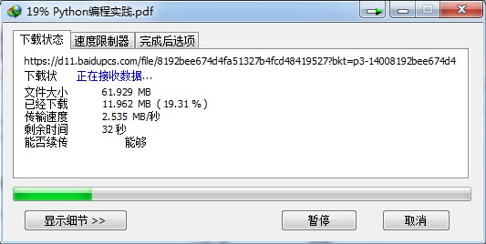

# 百度网盘分享文件下载链接解析

## 功能

- 获取百度网盘分享文件的真实下载地址
- 将获取到的下载链接复制到[IDM](http://www.internetdownloadmanager.com/)、[FDM](https://www.freedownloadmanager.org/)等下载器即可实现高速下载，避免使用百度网盘客户端



## 运行环境

- Python 2.7

## 第三方库

- [Requests](http://docs.python-requests.org/en/master/)


## 使用帮助

```sh
$ python baidu_wangpan_parse.py -h 
usage: baidu_wangpan_parse.py [-h] -f [FOLDER] -e [ENCRYPT] -l LINK [-p PASSWORD]

Get Baidu wangpan private sharing file download link.

optional arguments:
  -h, --help            show this help message and exit
  -f [FOLDER], --folder [FOLDER]
                        Whether the sharing is a folder, input should be either "true" or "false"
  -e [ENCRYPT], --encrypt [ENCRYPT]
                        Whether sharing file is encrypted, input should be either "true" or "false"
  -l LINK, --link LINK  Baidu wangpan sharing file link
  -p PASSWORD, --password PASSWORD
                        Baidu wangpan sharing file password
```

## 使用实例

1.获取没有加密的单个文件的下载地址：
```sh
$ python baidu_wangpan_parse.py -f false -e false -l https://pan.baidu.com/s/1dG1NCeH
Filename：Python编程实践.pdf
Download link：http://d.pcs.baidu.com/file/8192bee674d4fa51327b4fcd48419527?fid=271812880-250528-1043814616287203&time=1520084684&rt=sh&sign=FDTAERV-DCb740ccc5511e5e8fedcff06b081203-yNPeLZ6nlAnXIkJCc65h5%2BXyo7o%3D&expires=8h&chkv=1&chkbd=0&chkpc=&dp-logid=1435776569022977819&dp-callid=0&r=908173079
Size：64.938148MB
```

2.获取加密的单个文件的下载地址：
```sh
$ python baidu_wangpan_parse.py -f false -e true -l https://pan.baidu.com/s/1qZbIVP6 -p xa27
Filename：鸟哥的Linux私房菜-基础篇.第四版.pdf
Download link：http://d.pcs.baidu.com/file/db0be336c157d7cd2e1368c7a80833d6?fid=1708072416-250528-674694471059199&time=1520085857&rt=sh&sign=FDTAERV-DCb740ccc5511e5e8fedcff06b081203-GKPsyNzU2hRIFkk20A9uLuqYh10%3D&expires=8h&chkv=1&chkbd=0&chkpc=&dp-logid=1436091295408590002&dp-callid=0&r=130087421
Size：32.514175MB
```

3.获取没有加密的文件夹的打包下载地址
```sh
$ python baidu_wangpan_parse.py -f true -e false -l https://pan.baidu.com/s/1jH2KqZs
http://www.baidupcs.com/rest/2.0/pcs/file?method=batchdownload&app_id=250528&zipcontent=%7B%22fs_id%22%3A%5B%221042134294938382%22%5D%7D&sign=DCb740ccc5511e5e8fedcff06b081203:cSLPyTkEIozr9f4WlXdPv%2FCUCdE%3D&uid=540536034&time=1520268618&dp-logid=1461958037911350750&dp-callid=0&from_uk=540536034
```

4.获取加密的文件夹的打包下载地址
```sh
$ python baidu_wangpan_parse.py -f true -e true -l https://pan.baidu.com/s/1htWjWk0 -p 5ykw
http://www.baidupcs.com/rest/2.0/pcs/file?method=batchdownload&app_id=250528&zipcontent=%7B%22fs_id%22%3A%5B%22680498123896117%22%5D%7D&sign=DCb740ccc5511e5e8fedcff06b081203:XVWOmwcvFUuF%2BaingRW1tMuLJ4w%3D&uid=1708072416&time=1520268935&dp-logid=1462043150724484943&dp-callid=0&from_uk=1708072416
```

## 常见问题

文件打包下载后解压时提示`头部错误`， 解压失败。这个问题多发于`7-Zip`解压，换用`WinRAR`即可解压成功。

## Todo

- 解析文件夹的下载地址同时获取zip压缩包名字以及大小
- 精简命令行参数，实现自动识别下载内容是单文件/文件夹，加密/未加密。
